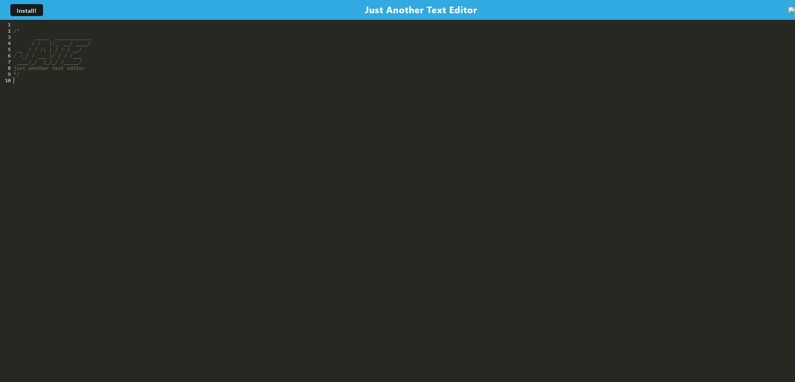

# PWA-Text-Editor

## Description 

This app functions as an online text editor, enabling users to generate notes or code snippets. The incorporation of service workers and Cache APIs ensures the app's full functionality even in offline mode, allowing users to revisit pages previously accessed while offline. 

---

# Overview

## The Challenge: 

Your task is to build a text editor that runs in the browser. The app will be a single-page application that meets the PWA criteria. Additionally, it will feature a number of data persistence techniques that serve as redundancy in case one of the options is not supported by the browser. The application will also function offline.

---

## Usage 

Link to: [deployed app](https://thawing-forest-16589-e5c569fbb6aa.herokuapp.com/)

--- 

## Author

Follow me on Github at [felipeokay](https://github.com/felipeokay)!

For any questions please contact me via email at: Kevinserrano0823@gmail.com.